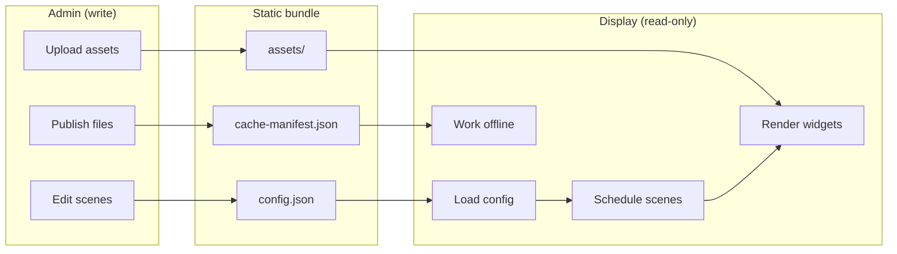
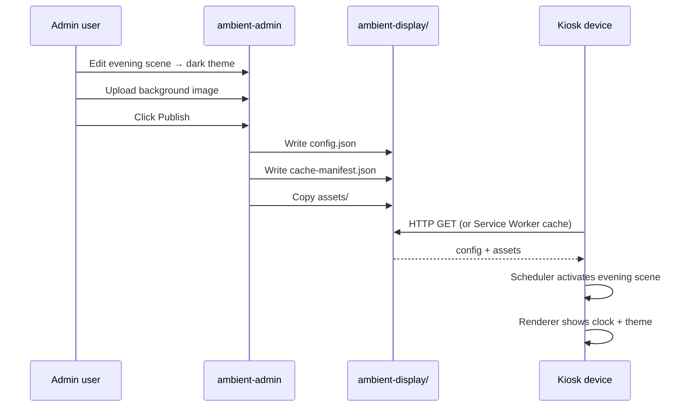

# Ambient Display — Project Goals

This document explains **what we are building**, **who it is for**, and **how the pieces fit together**.

---

## Vision

**Ambient Display** transforms old tablets, iPads, Raspberry Pis, smart TVs, and browsers into beautiful, always-on information displays — without apps, app stores, or backend servers.

The first supported device is an **iPad A1455** running older Safari. The display client must remain compatible with legacy browsers.

```
┌─────────────────────────────────────────────────────────────┐
│  Old hardware  +  Static web app  =  Ambient information    │
│  (iPad, Pi, TV)    (no server)        (clock, widgets…)     │
└─────────────────────────────────────────────────────────────┘
```

---

## Two applications, one system

The project is split into two **completely separate** applications:

| Application | Folder | Who uses it | Purpose |
|---|---|---|---|
| **Display** | `ambient-display/` | End viewer (passive) | Show content 24/7 on a wall-mounted device |
| **Admin** | `ambient-admin/` | Owner / PM / developer | Configure scenes, upload assets, publish updates |



**Golden rule:** The display never writes data. It only reads published static files.

---

## User side — the Display (kiosk)

### Who is the "user"?

On the display side, there is **no interactive user**. The device is a **viewer**:

- A tablet on a kitchen wall
- An iPad on a desk
- A Raspberry Pi hooked to a monitor
- A smart TV browser in kiosk mode

Nobody taps, logs in, or configures anything on this device.

### What the display does

1. **Boots** from cached static files (works offline after first load)
2. **Loads** `config/config.json`
3. **Applies** the active theme (light, dark, midnight, minimal)
4. **Activates** the correct scene based on **local device time** (morning → day → evening → night)
5. **Renders** widgets (clock, and future widgets) via the layout engine
6. **Updates** on a schedule — no server, no polling

### Display design constraints

These exist because the target hardware is old:

| Constraint | Reason |
|---|---|
| HTML, CSS, vanilla JavaScript only | No framework overhead on weak hardware |
| ES5-compatible | Old Safari on iPad A1455 |
| No npm, no build step | Deploy by copying files or GitHub Pages |
| Offline-first | Wi-Fi may drop; display must keep running |
| Service Worker caching | Static assets survive network loss (iOS 11.3+) |

### Display platform modules

```
ambient-display/
├── config/config.json     ← single source of runtime truth (published by admin)
├── js/
│   ├── app.js             ← bootstrap
│   ├── config-loader.js   ← fetch + validate config
│   ├── theme-engine.js    ← apply theme CSS classes
│   ├── layout-engine.js   ← position widgets (center, stack, grid…)
│   ├── renderer.js        ← mount widgets via registry
│   ├── scheduler.js       ← scene transitions by local time
│   ├── asset-manager.js   ← lazy images/video, memory cleanup
│   └── widget-registry.js ← extensible widget lookup
├── widgets/               ← self-registering widget modules
├── assets/                ← published images and videos
└── service-worker.js      ← offline cache
```

---

## Admin side — configuration & publishing

### Who uses the admin?

| Role | Typical tasks |
|---|---|
| **Home owner** | Set clock timezone, pick day/night themes |
| **PM / office manager** | Schedule scenes, upload branding assets |
| **Developer** | Add widgets, bump versions, deploy to GitHub Pages |

The admin runs on a **modern laptop or desktop browser** — not on the kiosk device.

### What the admin does

1. **Edits** scene schedule (start times, themes, layouts, widgets)
2. **Uploads** images and videos to a staging library
3. **Validates** config against the display contract
4. **Publishes** static files into `ambient-display/`:
   - `config/config.json`
   - `cache-manifest.json`
   - `assets/*`

### Admin design constraints

| Constraint | Reason |
|---|---|
| Separate from display | Different browser targets, different responsibilities |
| No backend server | Same static/GitHub Pages deployment model |
| Draft auto-save | Edits survive browser refresh |
| Validate before publish | Kiosk must never receive broken config |

### Admin modules

```
ambient-admin/
├── js/
│   ├── config-model.js    ← draft state
│   ├── scene-editor.js    ← morning/day/evening/night UI
│   ├── asset-library.js   ← IndexedDB upload staging
│   ├── validator.js       ← pre-publish checks
│   └── publish.js         ← export to display folder
└── scripts/publish.js     ← Node CLI fallback
```

---

## Data flow — from edit to wall



---

## Scenes — the core user experience

Scenes are how the **same device feels different** throughout the day:

| Scene | Typical time | Typical feel |
|---|---|---|
| **Morning** | 05:00 | Light theme, gentle clock |
| **Day** | 09:00 | Bright, 24-hour clock |
| **Evening** | 17:00 | Dark theme, winding down |
| **Night** | 21:00 | Midnight theme, minimal seconds |

The admin defines **what each scene contains**.  
The display scheduler decides **when to switch** — using local device time only.

---

## Widgets — extensible content blocks

Widgets are independent modules that self-register with the display:

| Today | Future |
|---|---|
| Clock | Weather, calendar, photos, RSS, status |

Adding a widget requires:

1. Create `widgets/my-widget.js` (registers with `widgetRegistry`)
2. Add script tag to `index.html`
3. Add widget entry in admin + config schema
4. **No changes to renderer.js**

---

## Offline & updates

| Concern | Solution |
|---|---|
| Display loses Wi-Fi | Service Worker serves cached HTML, CSS, JS, config |
| Admin publishes update | Bump version in `cache-manifest.json` → SW fetches changed assets only |
| Device wakes from sleep | Scheduler re-syncs scene; asset manager releases stale memory |

---

## Deployment model

Everything is **static files**. No database, no API, no cloud required.

```bash
# Local development
cd ambient-test
python -m http.server 8080
# Admin:   http://localhost:8080/ambient-admin/
# Display: http://localhost:8080/ambient-display/

# Production
# Deploy ambient-display/ to GitHub Pages, Netlify, or copy to USB/SD
```

---

## Responsibilities summary

| Concern | Display | Admin |
|---|---|---|
| Show content | ✅ | ❌ |
| Edit config | ❌ | ✅ |
| Upload assets | ❌ | ✅ |
| Scene scheduling logic | ✅ (runtime) | ✅ (configuration) |
| Theme / layout | ✅ (apply) | ✅ (choose) |
| Offline operation | ✅ | ❌ (needs browser) |
| Works on old Safari | ✅ | ❌ (modern browser OK) |

---

## Current status

| Area | Status |
|---|---|
| Display platform (renderer, theme, layout, scheduler) | ✅ Built |
| Clock widget | ✅ Built |
| Service Worker / offline cache | ✅ Built |
| Asset manager (lazy load, video) | ✅ Built |
| Admin app (scenes, publish) | ✅ MVP built |
| Additional widgets | 🔜 Planned |
| Live preview in admin | 🔜 Planned |
| Multi-device profiles | 🔜 Planned |

---

## Guiding principles

1. **Display is dumb, config is smart** — all behaviour comes from `config.json`
2. **Write once, read everywhere** — admin publishes; displays consume
3. **Offline is not optional** — kiosks run for days without network
4. **Old hardware matters** — ES5 display, progressive enhancement for SW
5. **Minimal footprint** — no build tools, no frameworks on the kiosk
6. **Extensible by design** — registry pattern for widgets, engines for theme/layout

---

## Related docs

- [Display quick start](../ambient-display/README.md)
- [Admin quick start](../ambient-admin/README.md)
