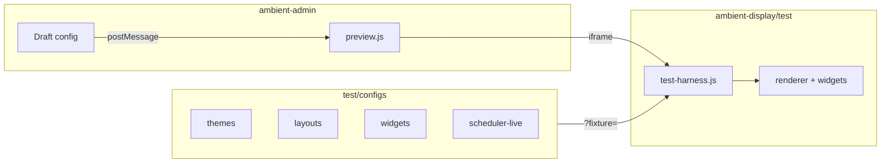

# Ambient Display — Testing

Structure for testing everything the admin manages and verifying it on the user-side display.

## URLs (serve from repo root)

```bash
python -m http.server 8080
```

| URL | Purpose |
|---|---|
| http://localhost:8080/test/ | **Test hub** — all fixtures |
| http://localhost:8080/ambient-display/test/ | **Test harness** — display runner |
| http://localhost:8080/ambient-admin/ | **Admin** — live preview iframe |
| http://localhost:8080/ambient-display/ | **Production display** |

## Architecture



## Workflow: admin → user reflection

1. Open **Admin** → **Preview** panel
2. Edit scenes, themes, or clock options
3. The iframe loads the **display test harness** (same code path as kiosk)
4. `preview.js` sends `ambient:preview-config` via postMessage
5. Harness re-renders — **no publish required for preview**

After preview looks correct:

6. **Publish** from admin → writes `ambient-display/config/config.json`
7. Reload **production display** to confirm published output

## Fixture groups

| Group | Fixtures | Tests |
|---|---|---|
| **baseline** | production | Published config mirror |
| **themes** | theme-dark, light, midnight, minimal | Theme engine |
| **layouts** | layout-center, stack, grid, fullscreen, top-bottom | Layout engine |
| **scenes** | scene-morning … scene-night | Forced scene from scheduler config |
| **widgets** | widget-clock-12h, widget-clock-24h | Clock widget options |
| **scheduler** | scheduler-live | Real time-based scene switching |

### Run a fixture

```
/ambient-display/test/index.html?fixture=theme-light
/ambient-display/test/index.html?fixture=layout-grid
/ambient-display/test/index.html?fixture=scene-night
/ambient-display/test/index.html?fixture=scheduler-live
```

Scene fixtures load `scheduler-live.json` and force that scene.

## Adding a new widget test

1. Create `test/configs/widget-{name}.json`
2. Add entry to `test/manifest.json`
3. Open test hub — new card appears automatically

## Manual QA checklist

- [ ] All 4 themes render correctly
- [ ] All 5 layouts position widgets correctly
- [ ] All 4 scenes force correctly in harness
- [ ] Scheduler transitions at boundary (scheduler-live fixture)
- [ ] Admin preview updates when editing scenes
- [ ] Admin preview matches published display after publish
- [ ] Clock 12h and 24h formats correct
- [ ] Timezone option applies (Asia/Kolkata)
- [ ] Offline: production display works after first load

## File map

```
test/
├── index.html           Test hub UI
├── manifest.json        Fixture catalog
├── configs/             JSON fixtures
└── README.md            This file

ambient-display/test/
├── index.html           Harness (loads platform JS)
├── test-harness.js      Fixture loader + postMessage preview
└── test-harness.css     Dev toolbar

ambient-admin/js/
└── preview.js           Sends draft to harness iframe
```
